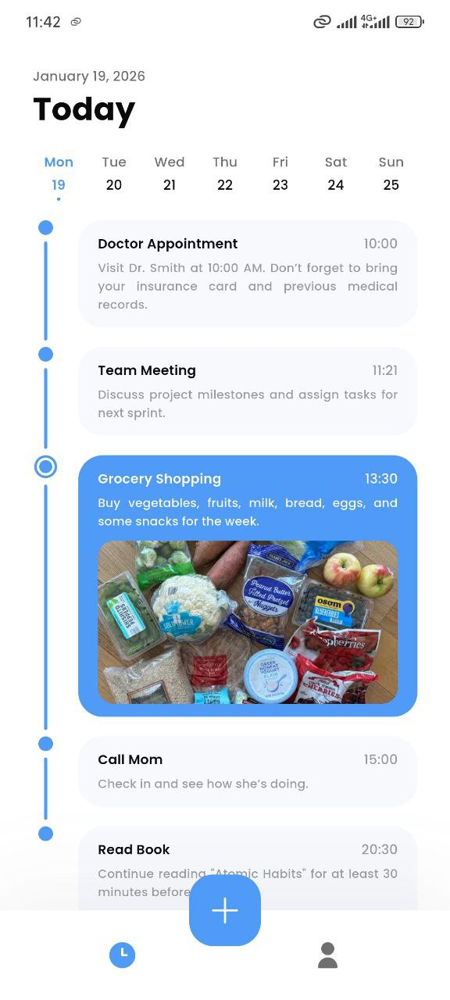
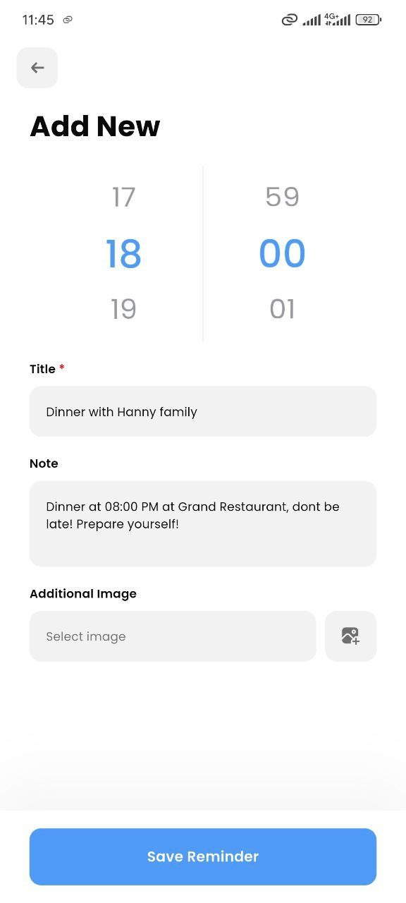
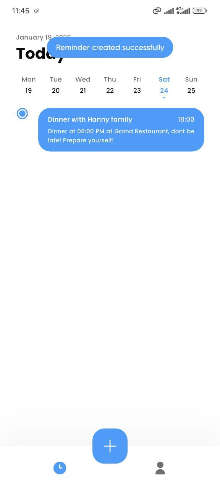
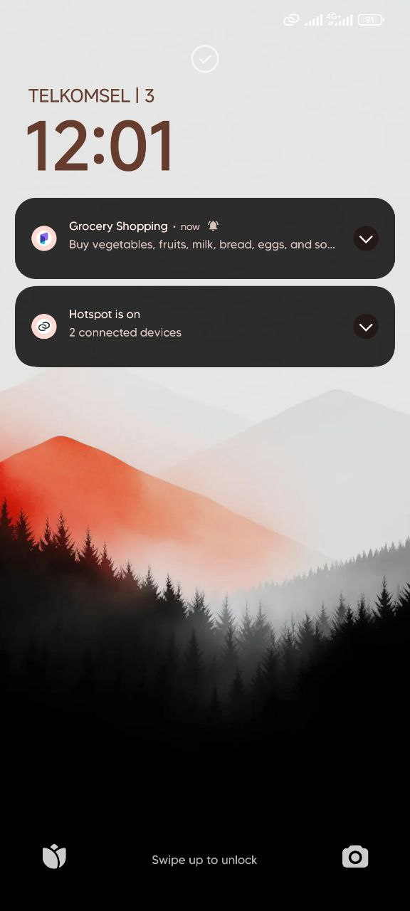
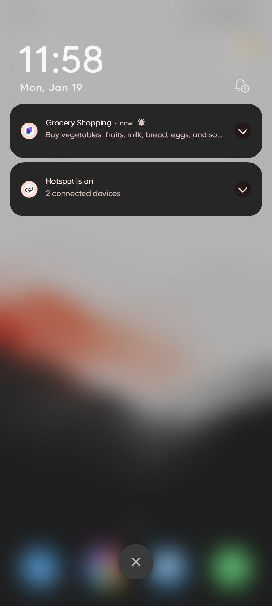
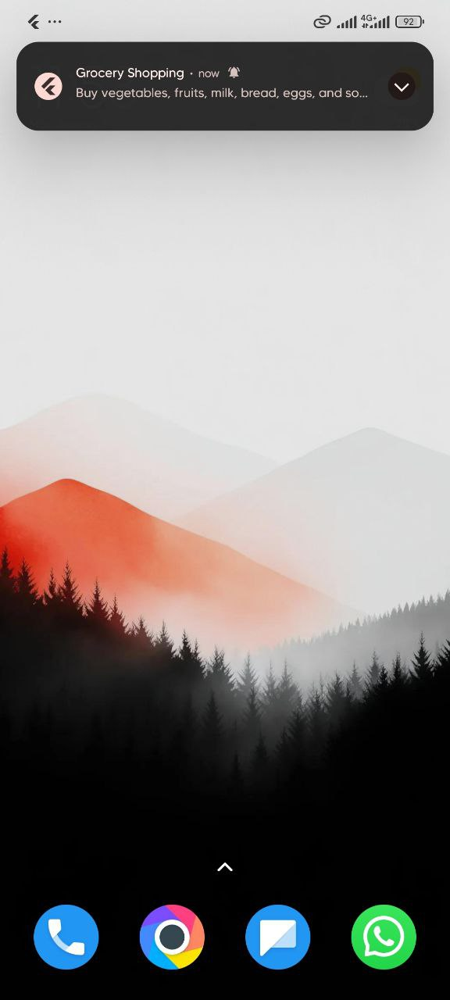
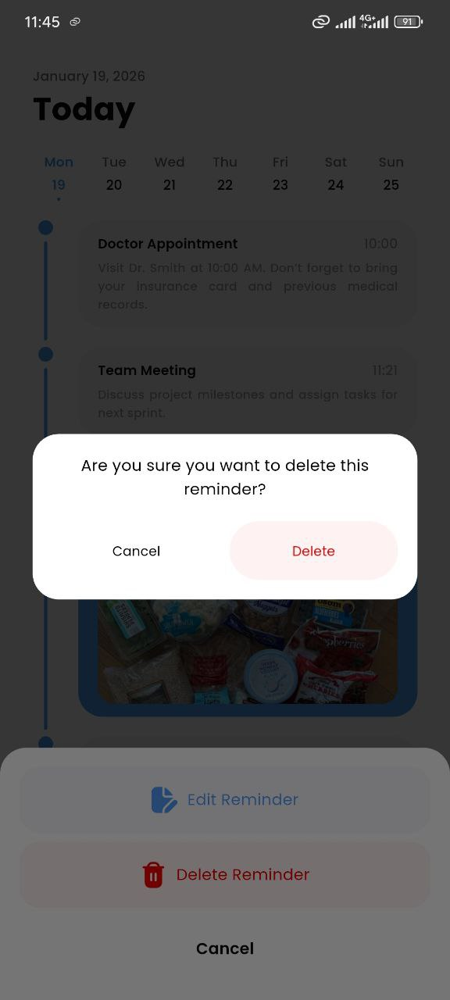
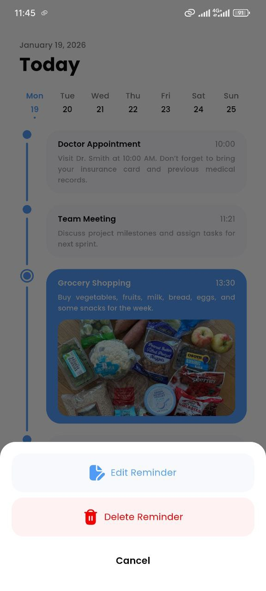
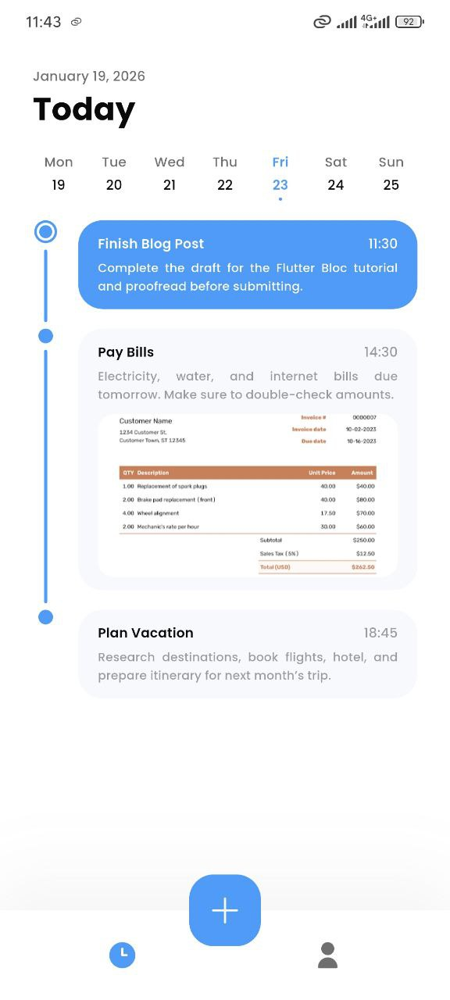

# Reminder App (Flutter + BLoC + Clean Architecture + SQLite + Alarm)

A Flutter application for managing reminders, with offline support using SQLite, scheduling alarms using android_alarm_manager_plus, and notifications using flutter_local_notifications. The app follows a BLoC + Clean Architecture pattern for maintainable and scalable code.

## 1. Setup Instructions

### Flutter Version

Make sure you are using Flutter 3.38.7:

flutter --version

### Clone the repository

git clone <repository_url>
cd <project_directory>

### Install dependencies

flutter pub get

### Generate code for Freezed & Injectable

flutter pub run build_runner build --delete-conflicting-outputs

### Run the app

flutter run

⚠️ On Android 13+, notification permissions are required. The app will prompt the user on first launch.

## 2. Dependencies Used

### State Management & Architecture

bloc
& flutter_bloc
– BLoC pattern for state management

fpdart
– Functional programming helpers (TaskEither, Either)

freezed
& freezed_annotation
– Immutable data classes

get_it

- injectable
  – Dependency injection

### Navigation & Routing

go_router
– Declarative routing

### UI & Helpers

flutter_screenutil
– Responsive sizing

flutter_svg
– SVG assets

fluttertoast
– Toast messages

lottie
– Animations

photo_view
– Zoomable images

scroll_snap_list
– Scrollable lists

shimmer
– Loading placeholder effects

### Data & Persistence

sqflite
– Local SQLite database

path
– Path helpers

json_annotation
& json_serializable
– JSON serialization

### Device & Platform Features

android_alarm_manager_plus
– Scheduling alarms

flutter_local_notifications
– Showing notifications

permission_handler
– Handling runtime permissions

android_intent_plus
– Android intents

image_picker
– Picking images from gallery/camera

## 3. BLoC Structure

The app follows Clean Architecture with separate layers for each feature.

lib/
├── core/
│ └── ... (services, utils, notifications)
├── features/
│ └── reminder/
│ ├── data/
│ │ ├── datasource/ (SQLite)
│ │ ├── models/
│ │ └── repository_impl/
│ ├── domain/
│ │ ├── entities/
│ │ ├── repository/
│ │ └── usecases/
│ └── presentation/
│ ├── bloc/ (ReminderBloc)
│ └── pages/ (ReminderPage, AddReminderPage)
└── main.dart

### Each feature has:

Data layer → handles SQLite / API / local storage
Domain layer → entities, repository interface, usecases
Presentation layer → UI, Bloc, and state handling
ReminderBloc:

- Handles fetch, delete, and updating reminders
- Works with ReminderUsecase which interacts with repository → datasource
- UI listens to Bloc states (loading, loaded, error) via BlocBuilder

## 4Bonus Feature: Create Reminder for Specific Dates

Users can select one or more specific dates for a reminder instead of repeating weekly.

Flow:

- User selects date(s) when creating a reminder
- Save reminder to SQLite with the selected date(s)
- Schedule an alarm via android_alarm_manager_plus for each chosen date
- When the alarm triggers, a notification is shown using flutter_local_notifications

Example: A user wants a reminder on March 21st, March 25th, and April 2nd. Each date triggers its own notification at the set time.

## Screenshots

### Notes

- Ensure notification permission is granted, especially on Android 13+
- All alarms are scheduled locally and will trigger even if the app is closed (wakeup = true)
- The app demonstrates a full offline reminder system using Clean Architecture and BLoC pattern
